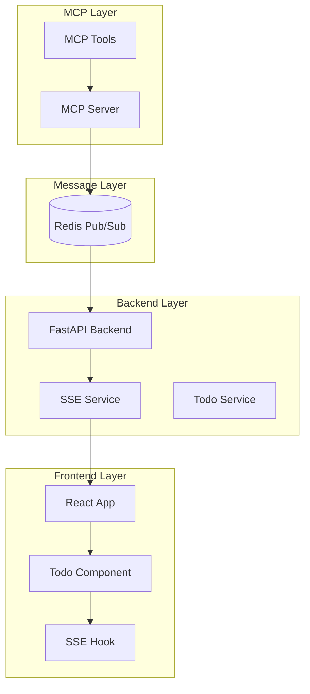

# 系统架构设计

## 概述

UI Component MCP Server Demo 是一个演示如何通过 MCP (Model Context Protocol) 协议实现前端组件状态实时控制的系统。本文档详细描述了系统的架构设计、组件交互和技术实现。

## 整体架构



## 核心组件

### 1. MCP Server
**职责**: 处理 MCP 协议调用，将工具调用转换为 Redis 消息

**技术栈**: Python + fastmcp + Redis

**核心功能**:
- 注册 MCP 工具 (add_todo, update_todo, delete_todo, toggle_todo)
- 接收 MCP 调用请求
- 生成标准化的 Redis 消息
- 发布消息到对应的 Redis 通道

**关键文件**:
- `mcp-server/src/main.py` - MCP 服务器主入口
- `mcp-server/src/tools/todo_tools.py` - Todo 相关的 MCP 工具
- `mcp-server/src/redis_client.py` - Redis 客户端封装

### 2. Backend (FastAPI)
**职责**: 处理 Redis 消息，管理应用状态，通过 SSE 推送更新

**技术栈**: FastAPI + Python + Redis + SSE

**核心功能**:
- 订阅 Redis 消息通道
- 处理业务逻辑 (Todo CRUD 操作)
- 管理内存状态 (演示用途)
- 通过 SSE 向前端推送实时更新
- 提供 REST API 接口

**关键文件**:
- `backend/app/main.py` - FastAPI 应用主入口
- `backend/app/services/redis_service.py` - Redis 消息处理
- `backend/app/services/sse_service.py` - SSE 服务
- `backend/app/services/todo_service.py` - Todo 业务逻辑
- `backend/app/routers/` - API 路由定义

### 3. Frontend (React)
**职责**: 展示用户界面，接收 SSE 更新，响应状态变化

**技术栈**: React + TypeScript + Tailwind CSS + shadcn/ui

**核心功能**:
- 渲染 Todo List 组件
- 建立 SSE 连接
- 处理实时状态更新
- 提供用户交互界面
- 错误处理和重连机制

**关键文件**:
- `frontend/src/App.tsx` - 应用主组件
- `frontend/src/components/TodoList/` - Todo 组件
- `frontend/src/hooks/useSSE.ts` - SSE 连接 Hook
- `frontend/src/hooks/useTodos.ts` - Todo 状态管理 Hook

### 4. Redis
**职责**: 作为消息中间件，连接 MCP Server 和 Backend

**功能**:
- Pub/Sub 消息通道
- 消息持久化 (可选)
- 高性能消息传递

## 消息流程详解

### 1. MCP 工具调用
```python
# MCP 工具调用示例
@tool
async def add_todo(title: str, description: str = "") -> str:
    """添加新的 todo 项"""
    message = {
        "type": "todo_add",
        "data": {
            "title": title,
            "description": description,
            "timestamp": datetime.now().isoformat()
        }
    }
    await redis_client.publish("todo_channel", json.dumps(message))
    return f"Todo '{title}' 添加成功"
```

### 2. Redis 消息格式
```typescript
interface Message {
  type: string;           // 消息类型 (todo_add, todo_update, etc.)
  data: any;             // 消息数据
  timestamp: string;     // 时间戳
  component?: string;    // 目标组件 (可选)
}
```

### 3. Backend 消息处理
```python
async def handle_redis_message(message: dict):
    """处理 Redis 消息"""
    message_type = message.get("type")
    data = message.get("data", {})
    
    if message_type == "todo_add":
        todo = await todo_service.create_todo(data)
        await sse_service.broadcast({
            "event": "todo_added",
            "data": {"todo": todo}
        })
```

### 4. SSE 事件推送
```typescript
// 前端 SSE 事件处理
useEffect(() => {
  if (lastEvent) {
    switch (lastEvent.event) {
      case 'todo_added':
        setTodos(prev => [...prev, lastEvent.data.todo]);
        break;
      case 'todo_updated':
        setTodos(prev => prev.map(todo => 
          todo.id === lastEvent.data.todo.id ? lastEvent.data.todo : todo
        ));
        break;
    }
  }
}, [lastEvent]);
```

## 数据模型

### Todo 模型
```typescript
interface TodoItem {
  id: string;
  title: string;
  description?: string;
  completed: boolean;
  createdAt: string;
  updatedAt: string;
}
```

### 消息类型
```typescript
type MessageType = 
  | "todo_add"
  | "todo_update" 
  | "todo_delete"
  | "todo_toggle"
  | "error";

type EventType =
  | "todo_added"
  | "todo_updated"
  | "todo_deleted"
  | "error";
```

## 扩展性设计

### 1. 组件扩展
系统设计支持添加新的可控制组件：

```typescript
// 新组件消息类型
interface ComponentMessage {
  type: string;
  component: string;  // 组件标识符
  data: any;
}

// 通道命名规范
const CHANNELS = {
  TODO: "todo_channel",
  CALENDAR: "calendar_channel",  // 新组件示例
  CHART: "chart_channel"         // 新组件示例
};
```

### 2. MCP 工具扩展
```python
# 新组件的 MCP 工具
@tool
async def update_chart_data(chart_id: str, data: list) -> str:
    """更新图表数据"""
    message = {
        "type": "chart_update",
        "component": "chart",
        "data": {
            "chart_id": chart_id,
            "data": data
        }
    }
    await redis_client.publish("chart_channel", json.dumps(message))
    return f"图表 {chart_id} 数据更新成功"
```

### 3. 前端组件扩展
```typescript
// 通用 SSE Hook
function useComponentSSE(component: string) {
  const { lastEvent } = useSSE(`/api/events/${component}`);
  // 组件特定的事件处理逻辑
}
```

## 性能考虑

### 1. 消息处理
- Redis 连接池管理
- 消息批处理
- 错误重试机制

### 2. SSE 连接
- 连接数限制
- 自动重连
- 心跳检测

### 3. 前端优化
- 组件懒加载
- 状态更新防抖
- 内存泄漏防护

## 安全考虑

### 1. 消息验证
- 消息格式验证
- 数据类型检查
- 权限验证

### 2. 连接安全
- CORS 配置
- 认证机制
- 速率限制

## 监控和日志

### 1. 系统监控
- Redis 连接状态
- SSE 连接数量
- 消息处理延迟

### 2. 日志记录
- 结构化日志
- 错误追踪
- 性能指标

## 部署架构

### 开发环境
```yaml
# docker-compose.yml
services:
  redis:
    image: redis:alpine
  
  mcp-server:
    build: ./mcp-server
    depends_on: [redis]
  
  backend:
    build: ./backend
    depends_on: [redis]
  
  frontend:
    build: ./frontend
    depends_on: [backend]
```

### 生产环境
- 容器编排 (Kubernetes)
- 负载均衡
- 服务发现
- 配置管理

## 总结

本架构设计实现了一个可扩展、高性能的 MCP 驱动的前端组件状态管理系统。通过清晰的分层设计和标准化的消息协议，系统能够支持多种组件类型的实时状态控制，为构建复杂的交互式应用提供了坚实的基础。
