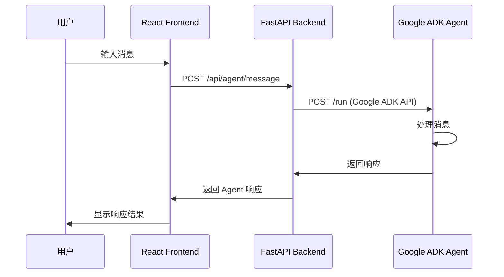

# UI to Agent 反向消息链路设计

本文档详细描述了从前端 UI 向 Agent 发送消息的反向消息链路设计。

## 概述

反向消息链路实现了从前端用户界面向 Google ADK Agent 发送消息的功能，与现有的 Agent → MCP → Frontend 控制流程形成完整的双向通信系统。

## 架构设计

### 整体架构图

```
┌─────────────────┐
│     React       │
│   Frontend      │
│                 │
└─────────┬───────┘
          │
          │ POST /api/agent/message
          │
          ▼
┌─────────────────┐
│   FastAPI       │
│    Backend      │
│                 │
└─────────┬───────┘
          │
          │ POST /run
          │
          ▼
┌─────────────────┐
│   Google ADK    │
│     Agent       │
│                 │
└─────────────────┘
```

### 消息流程



## API 设计

### 后端 API 端点

#### 发送消息到 Agent

**端点**: `POST /api/agent/message`

**请求格式**:
```json
{
  "message": "用户输入的消息内容",
  "sessionId": "demo"
}
```

**响应格式**:
```json
{
  "success": true,
  "response": {
    // Agent 返回的完整响应数据
  },
  "error": null
}
```

#### Agent 健康检查

**端点**: `GET /api/agent/health`

**响应格式**:
```json
{
  "agent_reachable": true,
  "agent_status": 200
}
```

### Google ADK Agent API

Agent 服务运行在 `http://localhost:8002`，使用 Google ADK 提供的标准 `/run` 端点。

**端点**: `POST http://localhost:8002/run`

**请求格式**:
```json
{
  "appName": "agent",
  "userId": "user", 
  "sessionId": "demo",
  "newMessage": {
    "parts": [
      {
        "text": "用户消息内容"
      }
    ],
    "role": "user"
  },
  "streaming": false
}
```

## 数据模型

### 前端类型定义

```typescript
interface AgentMessageRequest {
  message: string;
  sessionId?: string;
}

interface AgentResponse {
  success: boolean;
  response: any;
  error?: string;
}

interface AgentMessage {
  id: string;
  text: string;
  role: 'user' | 'agent';
  timestamp: number;
}
```

### 后端数据模型

```python
class AgentMessageRequest(BaseModel):
    message: str
    sessionId: Optional[str] = "demo"

class AgentRequest(BaseModel):
    appName: str = "agent"
    userId: str = "user"
    sessionId: str = "demo"
    newMessage: NewMessage
    streaming: bool = False

class NewMessage(BaseModel):
    parts: List[MessagePart]
    role: str = "user"

class MessagePart(BaseModel):
    text: str

class AgentResponse(BaseModel):
    success: bool
    response: Any
    error: Optional[str] = None
```

## 前端组件设计

### AgentChat 组件

主要的 Agent 对话组件，包含以下功能：
- 消息历史显示
- 消息输入界面
- 加载状态指示
- 错误处理显示

### AgentInput 组件

消息输入组件，支持：
- 多行文本输入
- 快捷键发送（Enter）
- 发送按钮
- 禁用状态管理

### useAgent Hook

自定义 React Hook，提供：
- 消息状态管理
- 发送消息功能
- 加载状态
- 错误处理
- 消息历史清理

## 集成方案

### 与现有系统的集成

1. **UI 集成**: Agent 对话组件将集成到现有的 Tools 页面中，作为独立的功能区域
2. **API 集成**: 新的 Agent API 路由将添加到现有的 FastAPI 后端中
3. **状态管理**: Agent 消息状态独立管理，不影响现有的 Todo 状态
4. **样式一致性**: 使用与现有组件相同的 Tailwind CSS 样式系统

### 错误处理策略

1. **网络错误**: 显示连接失败提示，允许重试
2. **Agent 超时**: 设置 30 秒超时，超时后显示错误信息
3. **Agent 不可用**: 通过健康检查端点检测 Agent 状态
4. **消息格式错误**: 验证消息格式，显示具体错误信息

## 安全考虑

1. **输入验证**: 对用户输入进行长度和内容验证
2. **会话管理**: 支持会话隔离，防止消息泄露
3. **错误信息**: 不暴露内部系统详细错误信息
4. **超时控制**: 防止长时间占用资源

## 扩展性设计

### 支持的扩展功能

1. **流式响应**: 可扩展支持 Agent 的流式响应
2. **多会话管理**: 支持多个并发会话
3. **消息类型**: 支持文本、图片等多种消息类型
4. **历史记录**: 可扩展支持消息历史持久化

### 配置选项

1. **Agent 端点**: 可配置 Agent 服务地址
2. **超时设置**: 可配置请求超时时间
3. **会话配置**: 可配置默认会话 ID
4. **UI 定制**: 支持主题和样式定制

## 测试策略

### 单元测试

1. **Hook 测试**: 测试 useAgent Hook 的各种状态
2. **组件测试**: 测试 AgentChat 和 AgentInput 组件
3. **API 测试**: 测试后端 Agent API 端点

### 集成测试

1. **端到端测试**: 测试完整的消息发送流程
2. **错误场景测试**: 测试各种错误情况的处理
3. **性能测试**: 测试并发消息处理能力

### 手动测试

1. **用户体验测试**: 验证界面交互的流畅性
2. **兼容性测试**: 测试不同浏览器的兼容性
3. **响应时间测试**: 验证消息响应的及时性

## 部署注意事项

1. **服务依赖**: 确保 Google ADK Agent 服务正常运行
2. **端口配置**: 确认 Agent 服务端口 8002 可访问
3. **环境变量**: 配置必要的环境变量
4. **监控告警**: 添加 Agent 服务的监控和告警

## 总结

反向消息链路的设计实现了用户与 AI Agent 的直接交互，与现有的 Agent → MCP → Frontend 控制流程形成完整的双向通信系统。该设计具有良好的扩展性和可维护性，为后续功能扩展奠定了基础。
